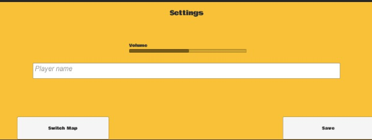
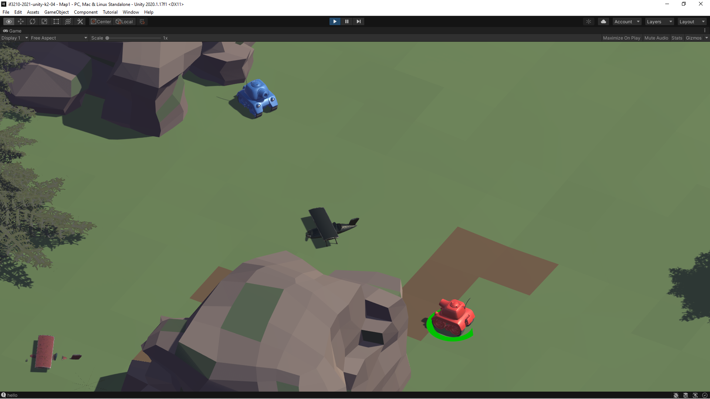
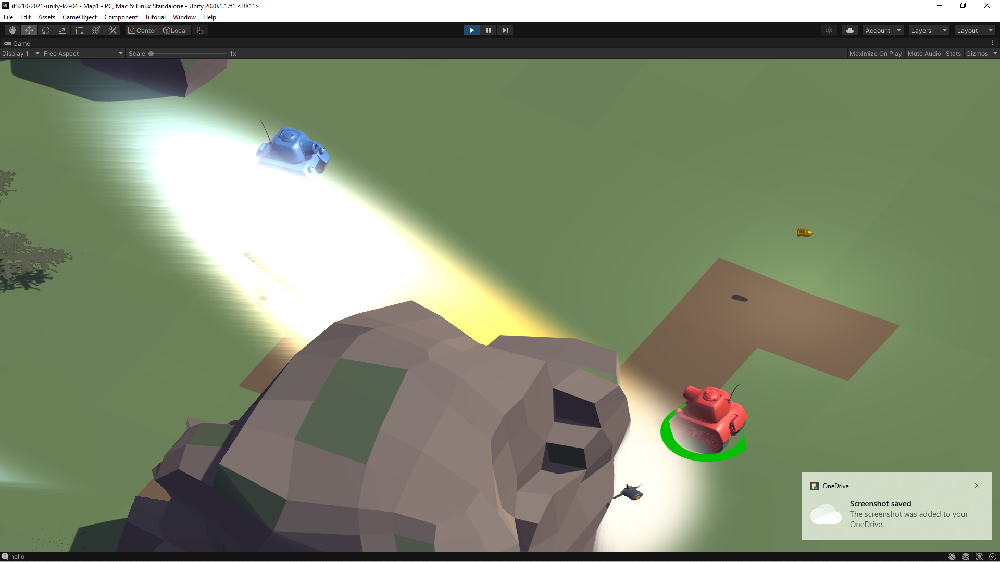
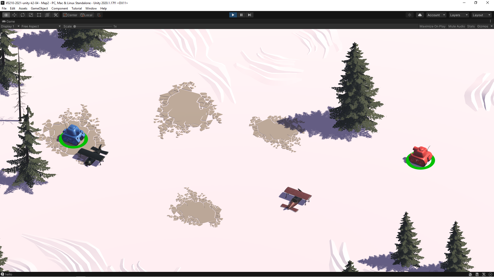
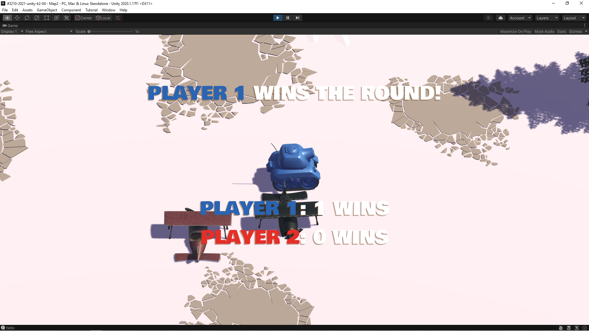

# IF3210-2021-Unity-K2-04

A repository for Platform Based Development task on Unity.

## Description

Permainan PvP menggunakan tank dengan tujuan menghabiskan _health_ lawan agar menjadi pemenang.

## How it Works

1. Atur volume dan masukkan nama pemain
2. Pilih map dengan mengklik tombol "Switch Map"
3. Mulai permainan dengan mengklik tombol "Save"
4. Gerakan tank dengan menggunakan _key_ W, A, S, D
5. Serang lawan dengan menggunakan _key_ spasi hingga kalah

## Libraries

-

## Screenshots

## Division of Task

1. 13518020 - Florencia Wijaya
   + player name setting
   + Additional characters
2. 13518092 - Izharulhaq
   + Volume setting
3. 13518149 - Stefanus Gusega Gunawan
   + Redesign map
   + Additional maps

## Credits

- <b>Low Poly Free Vegetation Pack</b> by <b>Catalin Pavel</b>
